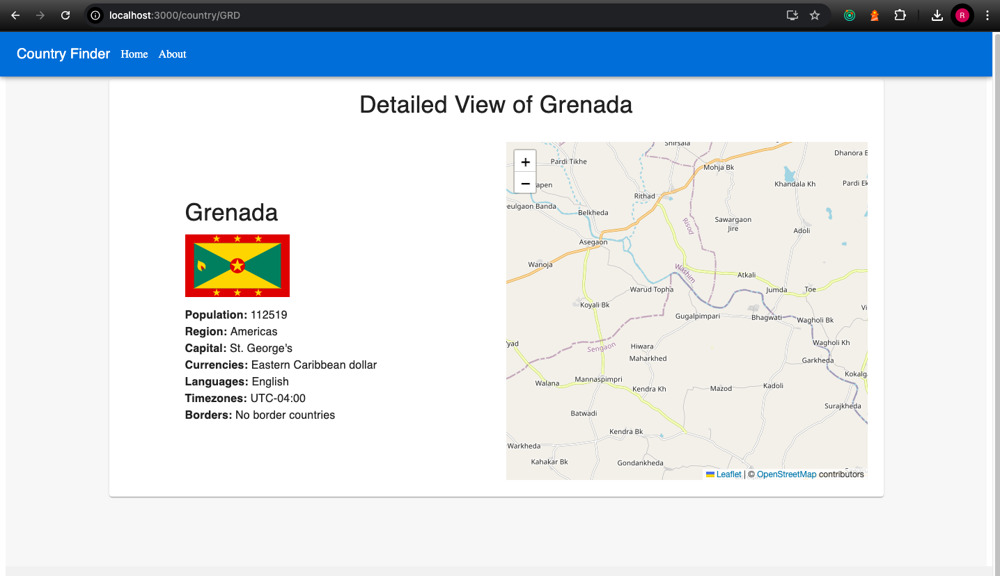

# Country Explorer

**Country Explorer** is a React application that allows users to explore information about different countries, including their population, region, currencies, languages, and more.

## Application Screenshot

Here is a preview of the Country Explorer application:





## Table of Contents

- [Technologies Used](#technologies-used)
- [Getting Started](#getting-started)
- [Project Structure](#project-structure)
- [API Endpoints](#api-endpoints)
- [Routing](#routing)
- [Features](#features)
- [Enhancements](#enhancements)
- [License](#license)

## Technologies Used

### Frontend:

- **React**: JavaScript library for building user interfaces.
- **TypeScript**: A superset of JavaScript that adds static types.
- **Redux Toolkit**: State management library.
- **Material-UI**: React component library for UI design.
- **React Router DOM**: For client-side routing.

### Backend :
- **Express**: JavaScript library for making servers.
- **TypeScript**: A superset of JavaScript that adds static types.
- **cors**: cors handling
- **Node js**: server side 

- **API Source**: [REST Countries API](https://restcountries.com/v3.1/), used for fetching country data.

## Getting Started

To get started with the project, follow these steps:

1. **Clone the repository:**

   ```bash
   git clone https://github.com/RAJNISHMSHRA/countryDetails.git
   cd country-explorer
   ```
    **For running client frontend:**
   cd frontend
   np install
   npm start

2. **Install dependencies:**

   ```bash
   npm install
   ```

3. **Create a `.env` file** in the root directory and add your environment variables:

   ```bash
   REACT_APP_API_URL=https://restcountries.com/v3.1/ or REACT_APP_API_URL=http://localhost:5000(for running server locally)
   ```

4. **Start the development server:**
      
    **For running Server:**
   cd frontend
   np install
   npm run dev


5. Open your browser and navigate to [http://localhost:3000](http://localhost:3000).

## Project Structure

```
country-explorer/
├── src/
│   ├── components/        # Reusable components
│   ├── features/          # Redux slices and state management
│   ├── pages/             # Different pages of the application
│   ├── store/             # Redux store configuration
│   ├── App.tsx            # Main application component
│   ├── index.tsx          # Entry point of the application
│   └── ...
├── public/
│   ├── index.html
│   └── ...
├── .env                   # Environment variables
├── .gitignore             # Files to ignore in the repository
├── README.md              # Project documentation
└── package.json           # Project metadata and dependencies
```

## API Endpoints

Here are the main API endpoints used in this project:

- **Get all countries:**
  - **URL**: `https://restcountries.com/v3.1/all`: http://localhost:5000/countries
  - **Method**: GET
  - **Description**: Returns a list of all countries with detailed information.

- **Get country by code:**
  - **URL**: `https://restcountries.com/v3.1/alpha/{code}` :http://localhost:5000/countries/SGS
  - **Method**: GET
  - **Description**: Returns detailed information about a country by its alpha code.

- **Search countries by name:**
  - **URL**: `https://restcountries.com/v3.1/name/{name}`
  - **Method**: GET
  - **Description**: Returns country details that match the search name.

## Routing

This project utilizes React Router for client-side routing. Below are the main routes defined in the application:

- **Home Page** (`/`): Displays a list of all countries.
- **Country Details** (`/country/:code`): Shows detailed information about a specific country with map and chart.
- **Home Page** (`/about`): Displays a chart list of all countries.
- **Country Details** (`*`): Error handling page for wrong url typed with nav back home

## Features

- Browse and search countries.
- View country details including population, region, languages, and currencies charts.
- Filter countries by region or subregion.
- First filter is global to search country on basis of capital,name ,population etc.
- Comparison chart page comparing top 10 country by population and languages spoken
- User-friendly interface with Material-UI components.

## Enhancements

- Add pagination for country list.
- Include a map view for visualizing country locations.
- filters  feature fto view specific data of country
- Include chart in about feature for population and languages spokenview for visualizing country locations.


## License
@Rajnish Mishra / rajnish.misraa@gmail.com
